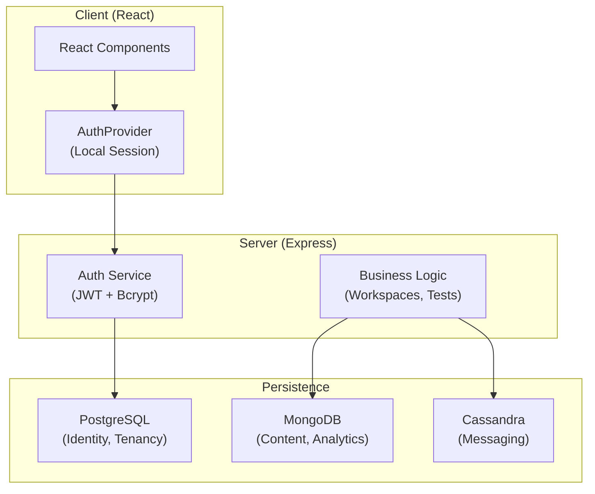
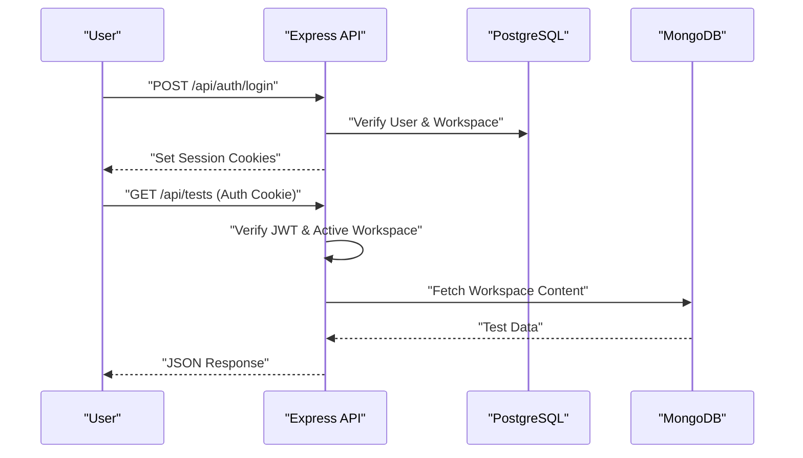

# Architecture Overview

<cite>
**Referenced Files in This Document**
- [server/index.ts](file://server/index.ts)
- [server/routes/auth.ts](file://server/routes/auth.ts)
- [server/lib/auth-workspace.ts](file://server/lib/auth-workspace.ts)
- [server/lib/pg-queries.ts](file://server/lib/pg-queries.ts)
- [scripts/pg-schema.sql](file://scripts/pg-schema.sql)
- [server/storage.ts](file://server/storage.ts)
- [shared/schema.ts](file://shared/schema.ts)
- [client/src/App.tsx](file://client/src/App.tsx)
- [client/src/contexts/firebase-auth-context.tsx](file://client/src/contexts/firebase-auth-context.tsx)
</cite>

## Introduction

PersonalLearningPro is a multi-tenant educational platform built on a modern, multi-database architecture. It has transitioned from a Firebase-dependent model to a self-hosted, workspace-centric identity system.

## Project Structure

- **`client/`**: React application using Vite. Includes a unified `AuthProvider` for session management.
- **`server/`**: Node.js/Express backend. Implements local auth, workspace tenancy, and AI orchestration.
- **`shared/`**: Zod schemas defining the platform's data contracts.

## Core Components

### 1. Identity & Tenancy (PostgreSQL)

All core transactional data—users, workspaces, memberships, and sessions—resides in PostgreSQL. This ensures relational integrity for multi-tenant workflows.

### 2. Content & Assessments (MongoDB)

Flexible document storage is used for tests, question banks, and AI-generated analytics, allowing for rapid schema evolution.

### 3. Real-time Messaging (Cassandra)

High-throughput chat and activity streams are partitioned by channel in Cassandra (Astra DB) for horizontal scalability.

### 4. Workspace-based Auth

Authentication is now local. Sessions use **HttpOnly Cookies** containing JWT access tokens and database-backed refresh tokens.

## Architecture Overview

The system follows a layered approach:

1. **Presentation**: React frontend with a role-aware router.
2. **Application**: Express API with workspace-scoped middleware.
3. **Domain**: Unified Zod schemas for all databases.
4. **Infrastructure**: Multi-database persistence layer.

## Security Architecture

- **Stateless Verification**: JWTs allow the server to verify sessions without database hits on every request.
- **Stateful Revocation**: Refresh tokens in PostgreSQL allow for immediate session revocation and rotation.
- **CSRF & XSS Mitigation**: Use of `HttpOnly`, `SameSite=Lax` cookies and strict CSP headers.

## Conclusion

PersonalLearningPro’s architecture is designed for scalability and data sovereignty. By centralizing identity in PostgreSQL while leveraging specialized NoSQL stores for content and messaging, the platform provides a robust, multi-tenant environment for educational collaboration.
