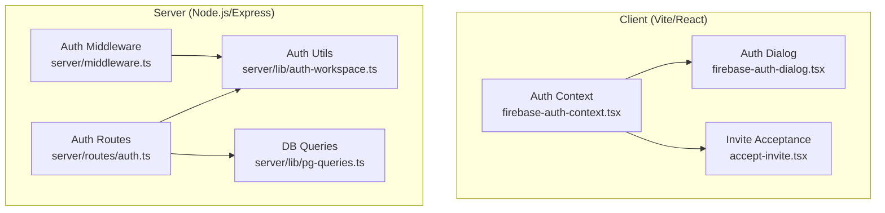
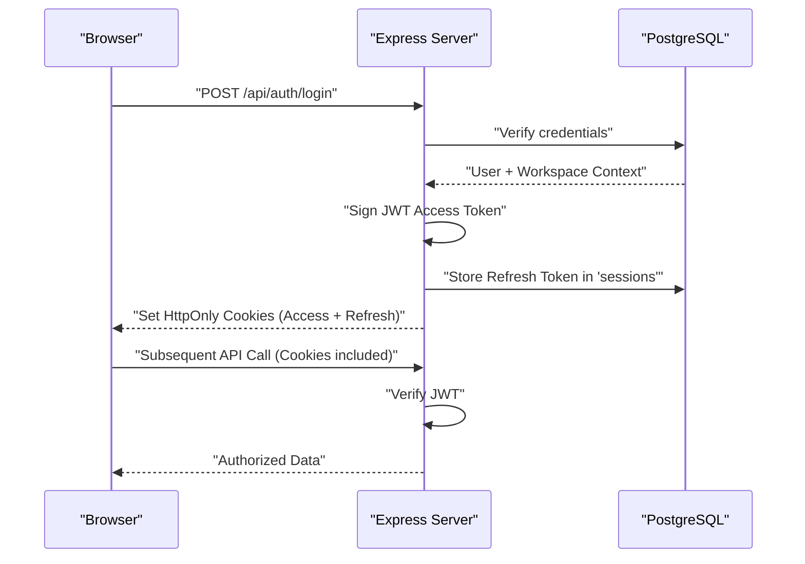

# Authentication & Authorization

<cite>
**Referenced Files in This Document**
- [auth-workspace.ts](file://server/lib/auth-workspace.ts)
- [firebase-auth-context.tsx](file://client/src/contexts/firebase-auth-context.tsx)
- [firebase-auth-dialog.tsx](file://client/src/components/auth/firebase-auth-dialog.tsx)
- [auth.ts](file://server/routes/auth.ts)
- [routes.ts](file://server/routes.ts)
- [middleware.ts](file://server/middleware.ts)
- [storage.ts](file://server/storage.ts)
- [pg-queries.ts](file://server/lib/pg-queries.ts)
- [schema.ts](file://shared/schema.ts)
</cite>

## Table of Contents

1. [Introduction](#introduction)
2. [Project Structure](#project-structure)
3. [Core Components](#core-components)
4. [Architecture Overview](#architecture-overview)
5. [Detailed Component Analysis](#detailed-component-analysis)
6. [Dependency Analysis](#dependency-analysis)
7. [Security Considerations](#security-considerations)
8. [Conclusion](#conclusion)

## Introduction

This document explains the workspace-based local authentication and authorization system for PersonalLearningPro. The platform has migrated from a Firebase-centric model to a self-hosted, PostgreSQL-backed identity system that supports multi-tenancy via "Workspaces".

Key features:
- Local email/password registration and login
- Multi-tenant Workspace architecture (Owner, Admin, Member roles)
- Secure session handling using JWT Access Tokens and PostgreSQL-backed Refresh Tokens
- Tokenized invitation system for onboarding members and students

## Project Structure

The authentication system is unified across the stack:

- **Client**: `AuthProvider` (React Context) manages session lifecycle and user state.
- **Server**: Express middleware and specialized routes handle token issuance, rotation, and RBAC.
- **Shared**: Zod schemas ensure consistent validation of credentials and workspace data.

## Core Components

- **`auth-workspace.ts`**: Core logic for token hashing, permission mapping, and payload generation.
- **`firebase-auth-context.tsx`**: (Renamed internally to `AuthProvider`) Centralized state for the frontend.
- **`auth.ts` (Routes)**: Endpoints for signup, login, refresh, logout, and password management.
- **`middleware.ts`**: Guards for enforcing session presence (`authenticateToken`) and workspace roles.
- **`pg-queries.ts`**: Relational database operations for users, workspaces, and memberships.

## Architecture Overview

The system uses a **Dual-Token Cookie-based** approach:

1. **Access Token (JWT)**: Short-lived (15m), stored in an `HttpOnly` cookie. Contains `userId` and `sessionId`.
2. **Refresh Token (Opaque)**: Long-lived (30d), stored in an `HttpOnly` cookie and the `sessions` table in PostgreSQL.
3. **RBAC**: Permissions are derived from the user's active `workspace_membership`.

## Detailed Component Analysis

### Workspace Signup & Tenancy

Registration now follows a "Workspace-first" model. When a user signs up:
1. A **User** record is created in PostgreSQL.
2. A **Workspace** is automatically created with the user as the **Owner**.
3. A **WorkspaceMembership** links the two.

### Token Rotation (Security)

To mitigate session hijacking, the system implements **Refresh Token Rotation**:
- Every time `/api/auth/refresh` is called, the old refresh token is invalidated and a new one is issued.
- If a leaked refresh token is reused, the entire session chain is invalidated.

### RBAC and Permissions

Roles are scoped to the **Active Workspace**:
- `owner`: Full control, billing, member management.
- `admin`: Content management, invites, analytics.
- `member`: Standard access to workspace features.

## Dependency Analysis

- **PostgreSQL**: Primary transactional store for identity.
- **JWT**: Stateless session verification.
- **Cookie-Parser**: Secure cookie extraction.
- **BcryptJS**: Password hashing.

## Security Considerations

- **HttpOnly Cookies**: Prevents XSS-based token theft.
- **CSRF Protection**: Mitigated via `SameSite=Lax` and custom headers.
- **Hashed Tokens**: Invitation and reset tokens are never stored in plain text.

## Conclusion

The new authentication system provides a robust, scalable, and secure foundation for multi-tenant educational workflows, removing the external dependency on Firebase while enhancing security and data sovereignty.
