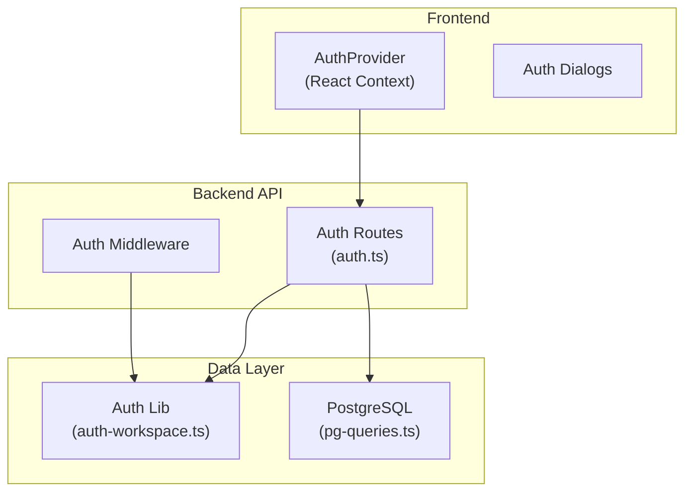
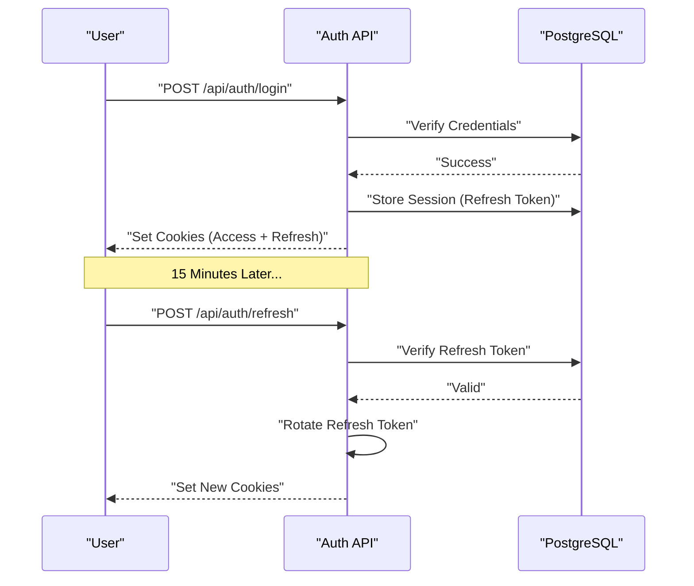

# Local & Workspace Authentication Integration

<cite>
**Referenced Files in This Document**
- [auth.ts](file://server/routes/auth.ts)
- [auth-workspace.ts](file://server/lib/auth-workspace.ts)
- [firebase-auth-context.tsx](file://client/src/contexts/firebase-auth-context.tsx)
- [middleware.ts](file://server/middleware.ts)
- [pg-queries.ts](file://server/lib/pg-queries.ts)
- [schema.ts](file://shared/schema.ts)
</cite>

## Table of Contents

1. [Introduction](#introduction)
2. [Project Structure](#project-structure)
3. [Core Components](#core-components)
4. [Architecture Overview](#architecture-overview)
5. [Detailed Component Analysis](#detailed-component-analysis)
6. [Security Considerations](#security-considerations)
7. [Conclusion](#conclusion)

## Introduction

This document provides comprehensive documentation for the local and workspace-based authentication system in PersonalLearningPro. It replaces the legacy Firebase implementation with a self-hosted, PostgreSQL-backed identity system designed for multi-tenancy.

## Project Structure

The authentication system is organized across three primary layers:

- **Server-side Logic**: Token hashing, permission mapping, and database queries.
- **API Layer**: Endpoints for signup, login, session refresh, and logout.
- **Frontend Integration**: React context for state management and cookie-based session handling.

## Core Components

### 1. Workspace-based Identity

Every user belongs to at least one workspace. Upon signup, a user creates their first workspace and is automatically assigned the "Owner" role.

### 2. Session Management

Sessions are managed via two HttpOnly cookies:

- **`access_token`**: A short-lived (15m) JWT used for authenticating individual requests.
- **`refresh_token`**: A long-lived (30d) opaque token stored in the database for regenerating access tokens.

### 3. Permissions & RBAC

Permissions are derived from the user's active workspace membership. The `permissionsForWorkspaceRole` function in `auth-workspace.ts` defines the mapping between roles and permission strings.

## Architecture Overview

The system implements a stateless-statful hybrid model:

- **Stateless**: The access token contains all info needed to verify a request without a database hit.
- **Stateful**: The refresh token requires a database lookup to ensure the session is still valid and not revoked.

## Detailed Component Analysis

### Signup Flow

Signup is a multi-step relational operation:

1. Create a `User` record with a hashed password (Bcrypt).
2. Create a `Workspace` with a unique slug.
3. Create a `WorkspaceMembership` linking the user to the workspace as `owner`.
4. Issue initial session tokens.

### Invite & Acceptance

1. An admin creates a `workspace_invite` record with a SHA-256 hashed token.
2. The user receives an email with a unique link.
3. Upon acceptance, the user sets their password, and a membership is created.

## Security Considerations

- **Password Hashing**: Uses `bcryptjs` with 12 salt rounds.
- **Cookie Security**: `HttpOnly`, `Secure` (in production), and `SameSite=Lax`.
- **Token Rotation**: Refresh tokens are rotated on every use to prevent replay attacks.
- **Hashed Tokens**: All invitation and reset tokens are hashed in the database.

## Conclusion

The transition to local workspace-based authentication provides the platform with greater control over data sovereignty, multi-tenant logic, and security workflows. By removing the external dependency on Firebase, we have achieved a more integrated and performant identity solution.
