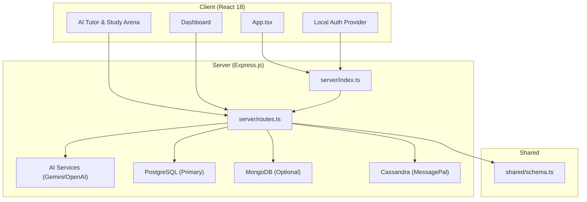
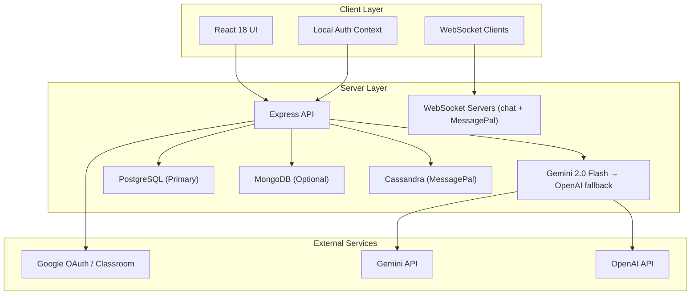
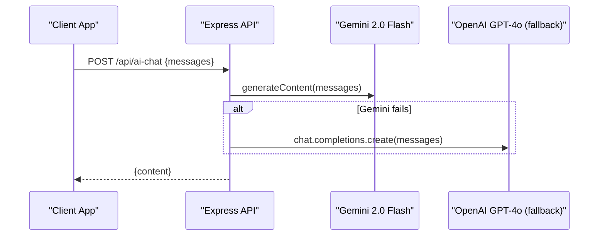
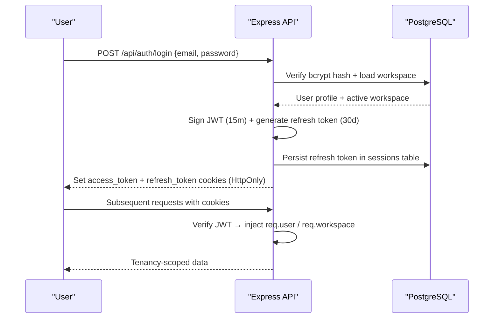
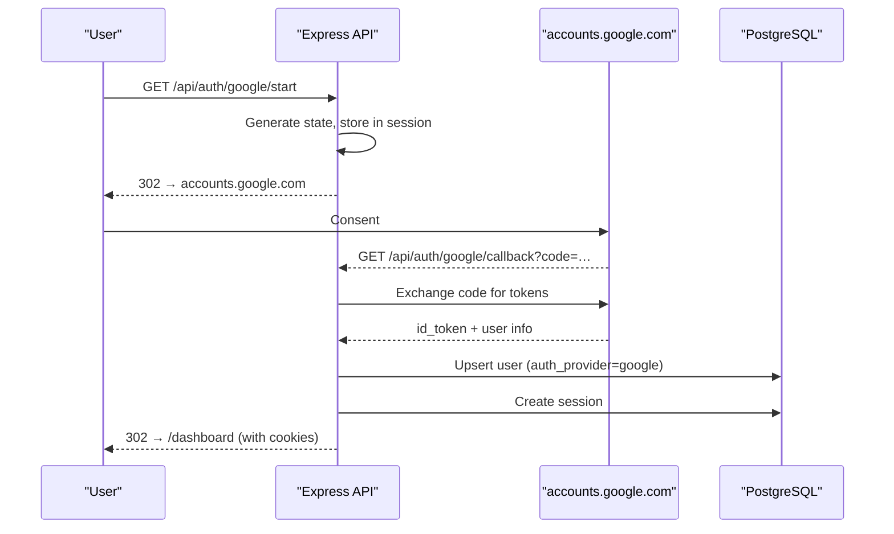

# Project Overview

<cite>
**Referenced Files in This Document**
- [README.md](file://README.md)
- [package.json](file://package.json)
- [server/index.ts](file://server/index.ts)
- [server/routes.ts](file://server/routes.ts)
- [server/lib/gemini.ts](file://server/lib/gemini.ts)
- [server/lib/openai.ts](file://server/lib/openai.ts)
- [server/lib/google-signin.ts](file://server/lib/google-signin.ts)
- [server/lib/cassandra.ts](file://server/lib/cassandra.ts)
- [server/lib/pg-queries.ts](file://server/lib/pg-queries.ts)
- [server/lib/pg-dynamic-sis.ts](file://server/lib/pg-dynamic-sis.ts)
- [client/src/App.tsx](file://client/src/App.tsx)
- [docker-compose.yml](file://docker-compose.yml)
- [shared/schema.ts](file://shared/schema.ts)
- [scripts/pg-schema.sql](file://scripts/pg-schema.sql)
</cite>

## Table of Contents

1. [Introduction](#introduction)
2. [Project Structure](#project-structure)
3. [Core Components](#core-components)
4. [Architecture Overview](#architecture-overview)
5. [Detailed Component Analysis](#detailed-component-analysis)
6. [Dependency Analysis](#dependency-analysis)
7. [Performance Considerations](#performance-considerations)
8. [Troubleshooting Guide](#troubleshooting-guide)
9. [Conclusion](#conclusion)

## Introduction

PersonalLearningPro (EduAI) is an AI-powered multi-tenant learning platform designed to enhance educational experiences through intelligent test creation, comprehensive performance analytics, and adaptive learning tools for students, teachers, administrators, and parents. The platform integrates modern technologies to deliver a seamless, real-time learning environment that supports both synchronous and asynchronous interactions, automated assessment, and AI-driven insights.

The platform's mission is to democratize access to personalized education by combining robust backend infrastructure with a responsive frontend, enabling institutions to improve learning outcomes through data-informed strategies and AI-assisted tutoring.

**Current version: 1.5.0** — PostgreSQL-primary, self-hosted auth, Google OAuth 2.0 (server-side), Dynamic SIS, Google Classroom LMS integration.

## Project Structure

The repository follows a monorepo-style organization with clear separation between client, server, and shared code:

- `client/` — React 18 frontend built with Vite, providing role-aware dashboards, AI tutoring, chat, Study Arena, and analytics.
- `server/` — Express.js backend serving APIs, managing sessions, integrating multi-provider LLMs, and handling WebSocket connections.
- `shared/` — Zod schemas and shared types used across client and server for consistent validation.
- `scripts/` — Database schema (`pg-schema.sql`), migration scripts, and utility scripts.
- `features/ai-classroom/` — Study Arena + IniClaw AI gateway (separate Docker services).
- `mobile/` — Expo Router mobile app.

## Core Components

### AI-Powered Capabilities

- **AI Tutor**: Interactive learning assistant with chat-based help and conversation persistence.
- **Study Arena (AI Classroom)**: Real-time interactive lesson playback with Whiteboard Canvas, video play, custom widgets, Speech Synthesis (TTS), and Whisper-based Speech-to-Text (ASR) input.
- **Test Creation**: AI-assisted question generation and rubric-based evaluation.
- **Answer Evaluation**: Automatic evaluation of subjective answers using Gemini 2.0 Flash (primary) or OpenAI GPT-4o (fallback).
- **Performance Analysis**: AI insights into student performance patterns and recommendations.

### Core Functionality

- **User Management**: Workspace-centric multi-tenancy with RBAC (Owner, Admin, Member).
- **Test Management**: Create, distribute, and evaluate tests with class-based visibility. Stored in PostgreSQL.
- **Dynamic SIS**: Flexible student information system — custom bases, tables, fields, records, views.
- **Google Classroom Integration**: OAuth-based import of courses and students.
- **OCR Test Scanning**: Convert physical test papers to digital format via Tesseract.js.
- **Analytics Dashboard**: Visual representation of performance metrics.
- **Live Classes**: Daily.co video integration.
- **MessagePal**: Real-time WebSocket chat with Cassandra/MongoDB persistence.

## Architecture Overview

The platform employs a layered architecture:

- **Frontend (React 18/Vite)**: Role-aware UIs, real-time chat, AI tutoring, Study Arena.
- **Backend (Express.js)**: RESTful APIs, session management, LLM/media integrations.
- **Real-Time**: Two WebSocket servers (chat + MessagePal) attached to the HTTP server.
- **Data Layer**: PostgreSQL for all transactional data; MongoDB optional; Cassandra for chat.
- **AI Integration**: Gemini 2.0 Flash primary, OpenAI GPT-4o fallback.
- **Authentication**: Self-hosted JWT + cookies + server-side Google OAuth 2.0.

## Detailed Component Analysis

### Technology Stack

| Layer | Technology |
|---|---|
| Frontend | React 18, Vite, TypeScript, Tailwind CSS, shadcn/ui, wouter, React Query |
| Backend | Node.js 18+, Express, TypeScript, tsx |
| Primary DB | PostgreSQL (pg pool, raw queries in `server/lib/pg-queries.ts`) |
| Message Store | Cassandra (Astra DB) → MongoDB fallback |
| AI | Google Gemini 2.0 Flash (`@google/generative-ai`) + OpenAI GPT-4o (`openai`) |
| Auth | Local JWT + HttpOnly cookies + Google OAuth 2.0 (server-side) |
| Real-time | WebSockets (`ws`) + Daily.co (`@daily-co/daily-react`) |
| LMS | Google Classroom API (`googleapis`) |
| Infrastructure | Docker, GCP Cloud Run, Cloud Build, Terraform, Secret Manager |

### AI Integration

All AI features use Gemini 2.0 Flash as the primary provider:

- **AI Chat / Tutor**: `server/lib/openai.ts` (wraps both Gemini and OpenAI)
- **Grading**: `server/services/gradingService.ts` — Gemini with JSON mode
- **Study Arena**: `server/services/study-arena/` — classroom generation pipeline
- **SIS Enrichment**: `server/services/dynamic-enrichment.ts`

### Authentication Flow

### Google OAuth Flow

### Real-Time Communication

Two WebSocket servers are attached to the HTTP server after `registerRoutes()`:

- **Chat WebSocket** (`server/chat-ws.ts`): General workspace chat.
- **MessagePal WebSocket** (`server/message/`): Dedicated messaging with Cassandra persistence.

### Data Models

Zod schemas in `shared/schema.ts` define validation for all API inputs. PostgreSQL schema in `scripts/pg-schema.sql`.

Key entities: `users`, `workspaces`, `workspace_memberships`, `workspace_invites`, `sessions`, `otps`, `tests`, `questions`, `test_attempts`, `answers`, `analytics`, `dynamic_bases/tables/fields/records/views`, `lms_connections`.

## Dependency Analysis

Key production dependencies:

| Package | Purpose |
|---|---|
| `express` | HTTP server |
| `pg` | PostgreSQL client |
| `@google/generative-ai` | Gemini 2.0 Flash |
| `openai` | OpenAI GPT-4o fallback |
| `jsonwebtoken` | JWT signing/verification |
| `bcryptjs` | Password hashing |
| `nodemailer` | SMTP email |
| `ws` | WebSocket server |
| `cassandra-driver` | Astra DB client |
| `react` + `vite` | Frontend |
| `wouter` | Client-side routing |
| `@tanstack/react-query` | Server state management |
| `zod` | Schema validation |
| `stripe` | Billing (disabled until configured) |
| `tesseract.js` | OCR |
| `@daily-co/daily-react` | Video calls |

## Performance Considerations

- **Single process**: `npm run dev` runs both frontend (Vite middleware) and backend in one `tsx` process.
- **React Query**: Client-side data fetching with caching and background refetch.
- **Gemini streaming**: Long AI responses use streaming to reduce time-to-first-byte.
- **PostgreSQL pool**: Connection pooling via `pg.Pool` in `server/db-pg.ts`.
- **Rate limiting**: `/api/ai` 20/min, `/api/auth` 10/min, `/api/upload` 10/15min, `/api/ocr` 5/min.

## Troubleshooting Guide

| Issue | Resolution |
|---|---|
| PostgreSQL connection error | Check `POSTGRESQL_URL` and that PostgreSQL is running. Run `psql -l` to verify. |
| AI features not working | Set `GOOGLE_API_KEY` with a valid Gemini key from aistudio.google.com. |
| Emails not sending | Check SMTP settings. Gmail requires an App Password. |
| Google OAuth broken | Verify redirect URIs are registered in GCP Console for the OAuth Web client. |
| Cookies not setting | Use `localhost:5001` not `127.0.0.1`. |
| Stripe routes returning 503 | Expected until `STRIPE_SECRET_KEY` is set to a real `sk_live_`/`sk_test_` key. |
| MongoDB errors on startup | Non-fatal. Set `MONGODB_URL` to enable, or leave unset to skip. |

## Conclusion

PersonalLearningPro v1.5 represents a mature, PostgreSQL-primary architecture with self-hosted identity, server-side Google OAuth, a flexible Dynamic SIS, and Gemini-powered AI across all features. The platform is deployed on GCP Cloud Run with full CI/CD via Cloud Build, and is designed to scale with institutional needs while remaining straightforward to run locally.
