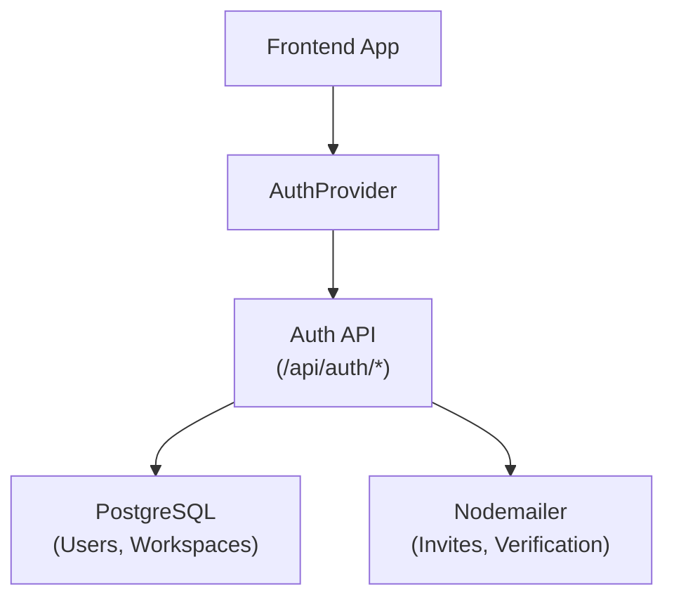

# User Management System

<cite>
**Referenced Files in This Document**
- [auth.ts](file://server/routes/auth.ts)
- [auth-workspace.ts](file://server/lib/auth-workspace.ts)
- [pg-queries.ts](file://server/lib/pg-queries.ts)
- [firebase-auth-context.tsx](file://client/src/contexts/firebase-auth-context.tsx)
- [schema.ts](file://shared/schema.ts)
</cite>

## Table of Contents

1. [Introduction](#introduction)
2. [Workspace-based Tenancy](#workspace-based-tenancy)
3. [User Lifecycle](#user-lifecycle)
4. [Role Hierarchy](#role-hierarchy)
5. [Architecture Overview](#architecture-overview)
6. [Conclusion](#conclusion)

## Introduction

PersonalLearningPro’s user management system has evolved from a simple role-based model to a robust, multi-tenant workspace architecture. This system governs identity, tenancy, and access control across the entire platform.

## Workspace-based Tenancy

The platform is structured around "Workspaces". A workspace is a logical container for students, teachers, content, and collaboration.

- **Isolation**: Data is scoped to a specific `workspace_id`.
- **Ownership**: Every workspace has a single "Owner" who has full billing and management rights.
- **Membership**: Users can be members of multiple workspaces, each with a different role.

## User Lifecycle

### 1. Onboarding (Signup)
Users sign up by creating their first workspace. This process simultaneously creates:
- A global `User` account.
- A new `Workspace` entry.
- A `WorkspaceMembership` linking the two with the `owner` role.

### 2. Invitations
New members are brought into workspaces via a secure invitation system:
- Admins send an invite to an email address.
- A tokenized link is generated and sent via email.
- Upon clicking, the user joins the workspace and completes their profile.

### 3. Session & Logout
Sessions are tracked in the `sessions` table in PostgreSQL, allowing for remote logout and session revocation.

## Role Hierarchy

Roles are enforced at two levels:
1. **System Level**: `admin`, `teacher`, `student`, `parent`.
2. **Workspace Level**: `owner`, `admin`, `member`.

This dual-layer approach allows for flexible institutional structures (e.g., a "Teacher" who is a "Workspace Admin").

## Architecture Overview

The system uses a unified PostgreSQL database for all identity and tenancy data, ensuring transactional consistency.

## Conclusion

By centralizing user management in a relational PostgreSQL schema, PersonalLearningPro provides a secure and scalable foundation for multi-tenant educational environments. The system balances global identity with granular, workspace-scoped access control.
