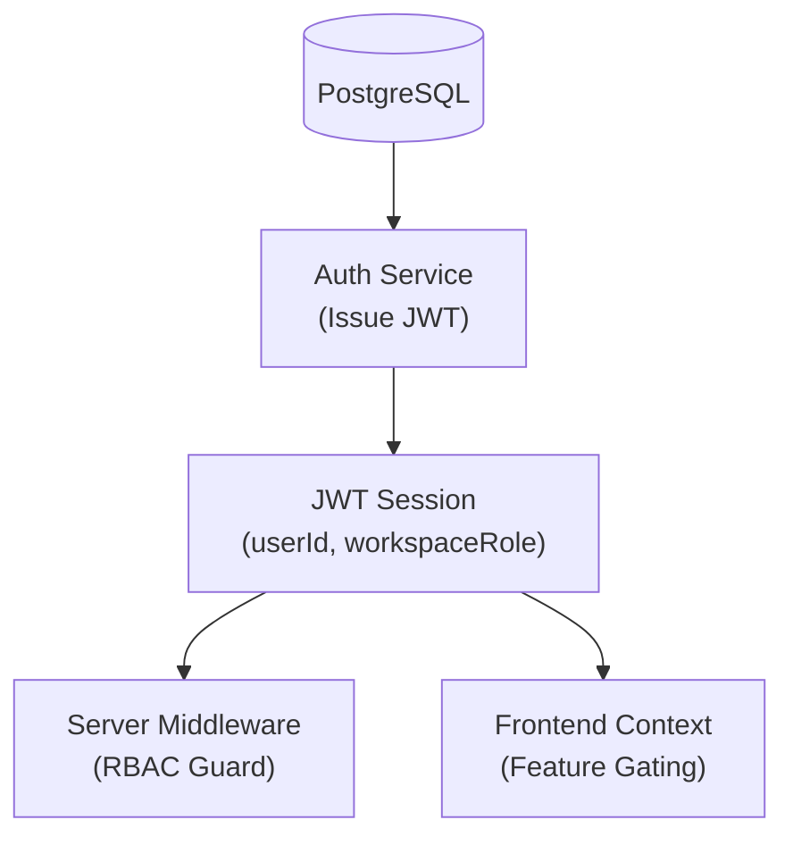

# User Roles & Permissions

<cite>
**Referenced Files in This Document**
- [auth-workspace.ts](file://server/lib/auth-workspace.ts)
- [middleware.ts](file://server/middleware.ts)
- [firebase-auth-context.tsx](file://client/src/contexts/firebase-auth-context.tsx)
- [pg-queries.ts](file://server/lib/pg-queries.ts)
- [schema.ts](file://shared/schema.ts)
</cite>

## Table of Contents

1. [Introduction](#introduction)
2. [Workspace Role Hierarchy](#workspace-role-hierarchy)
3. [Educational Role Mapping](#educational-role-mapping)
4. [Authorization Middleware](#authorization-middleware)
5. [Permissions Mapping](#permissions-mapping)
6. [Architecture Overview](#architecture-overview)
7. [Conclusion](#conclusion)

## Introduction

PersonalLearningPro uses a multi-layered permission system. Access is controlled by both a user's **System Role** (e.g., Student, Teacher) and their **Workspace Role** (e.g., Owner, Admin). This ensures that while a teacher has access to educational tools, their actions are scoped to the specific workspaces they belong to.

## Workspace Role Hierarchy

Roles are defined per workspace and stored in the `workspace_memberships` table.

| Role | Access Level | Responsibilities |
| ---- | ------------ | ---------------- |
| **Owner** | Full Control | Billing, workspace settings, deleting workspace, managing admins. |
| **Admin** | Management | Inviting members/students, content moderation, analytics. |
| **Member** | Standard | Accessing channels, participating in tests, using AI tutor. |

## Educational Role Mapping

Every user also has a system-wide role which determines their default UI and educational capabilities.

- **Admin/Owner**: Typically used for school principals or business managers.
- **Teacher**: Used for instructors; grants permission to create tests and manage classrooms.
- **Student**: Default role for learners; grants permission to attempt tests and view results.

## Authorization Middleware

The server uses specialized middleware to enforce these roles:

- `authenticateToken`: Verifies the JWT and injects `req.user` and `req.workspace`.
- `requireWorkspaceRole('owner', 'admin')`: Restricts access to workspace management features.
- `requireActiveWorkspace`: Ensures the user is acting within a valid workspace context.

## Permissions Mapping

Permissions are dynamically calculated based on the user's role in their active workspace.

```typescript
// server/lib/auth-workspace.ts
export function permissionsForWorkspaceRole(role?: WorkspaceRole): string[] {
  if (role === "owner") {
    return [
      "workspace:read",
      "workspace:update",
      "workspace:billing",
      "workspace:invite",
      "workspace:members:manage",
    ];
  }
  // ...
}
```

## Architecture Overview

Permissions flow from the database into the JWT session and are then enforced by the server and reflected in the UI.



## Conclusion

The unified role system provides granular control over both institutional management and educational workflows. By combining relational workspace memberships with stateless JWT claims, the platform achieves high performance and strict security boundaries.
